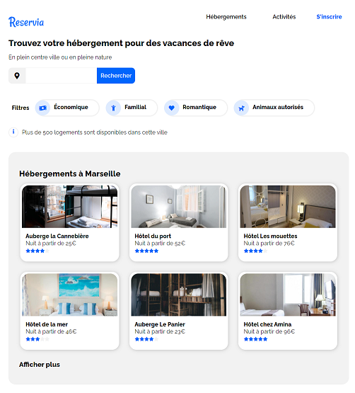

# Projet 2 Openclassrooms: Reservia

Le projet consiste à créer un prototype en intégrant la maquette fournie en HTML et CSS.

## Démarrage

Le site est hébergé sur [Github-Pages](https://anthonyj408.github.io/JAMMESAnthony_2_14062021/)

